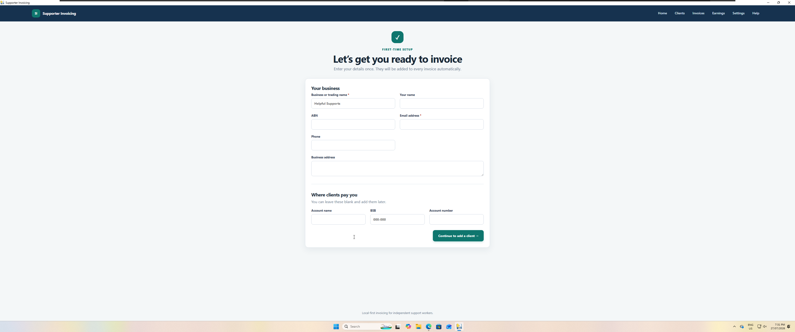
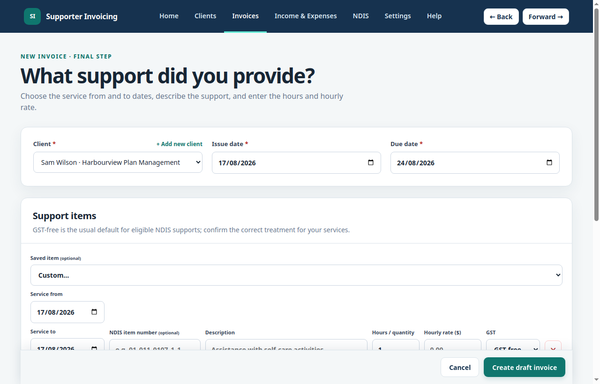
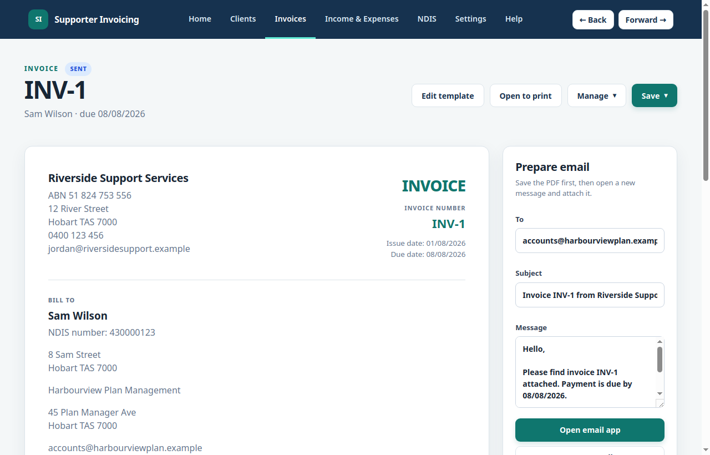
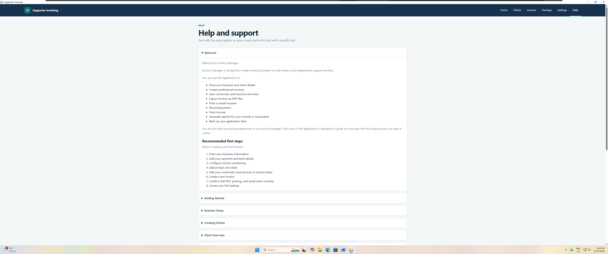
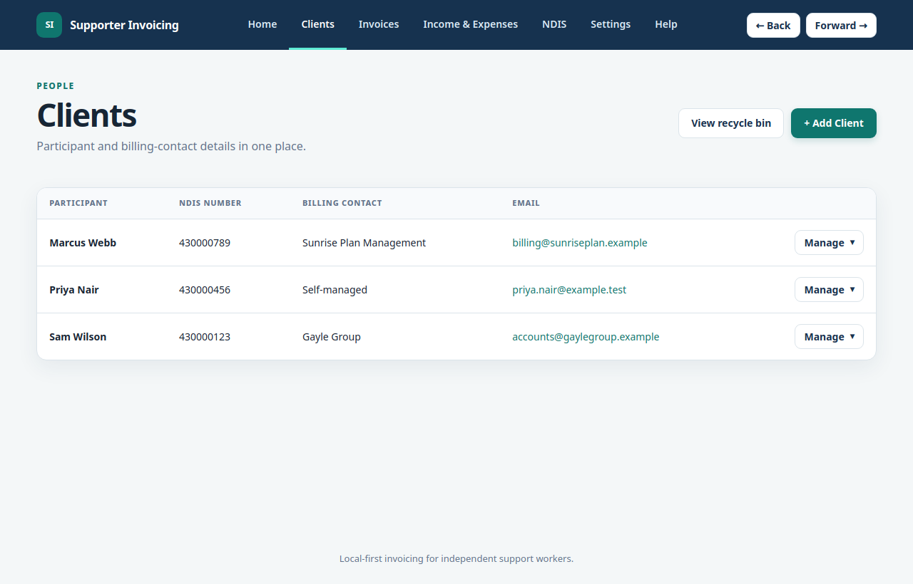
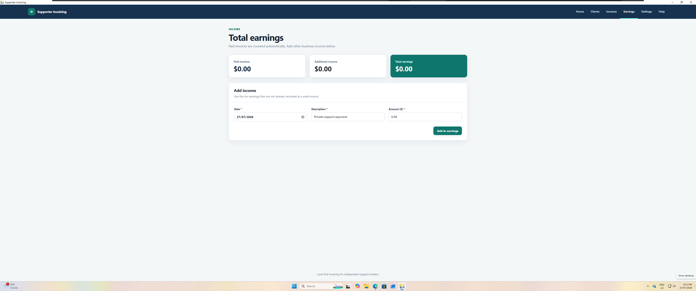
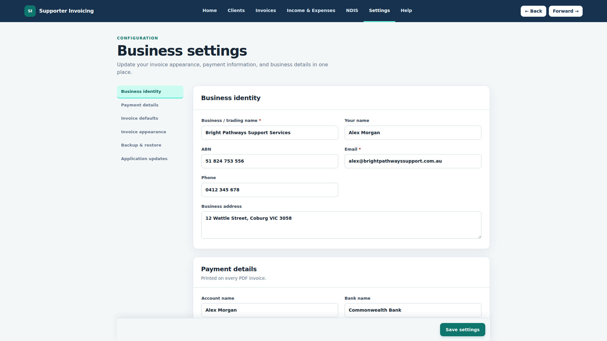

## Supporter Invoicing

A modern desktop invoicing application designed for Australian sole trader support workers.

Supporter Invoicing was created after observing how much time sole trader support workers spend manually preparing invoices, exporting PDFs, tracking income, and managing client records. The goal of this project is to streamline that workflow into a single, easy-to-use desktop application, allowing support workers to spend less time on administration and more time supporting their clients.

> **Status:** Active Development (Pre-release)

---

# Features

## Dashboard

- Business overview
- Outstanding invoices
- Monthly earnings
- Financial year earnings
- Quick access to common tasks

## Client Management

- Store client information
- Manage client records
- View client history
- Safe client deletion (for clients without associated invoices)
- Save NDIS line items per client (item number, description, rate, and GST) for quick reuse on invoices
- Live search for NDIS item numbers when adding a client's saved line items, with description and price prefilled automatically

## Invoice Management

- Create professional invoices
- Automatic invoice numbering
- Pick a client's saved line items from a dropdown to quickly fill in an invoice line
- Edit, duplicate, and delete existing invoices
- Generate PDF invoices
- Save invoice PDFs to a configured default folder
- Print invoices
- Email-ready invoices

## NDIS Pricing Catalogue

- Ships with the current NDIS Pricing Schedule pre-loaded, so it's ready to use as soon as you install
- Search support items by number or name
- Import an updated NDIS Pricing Schedule PDF at any time
- Check the NDIS website for newer schedule versions

## Earnings

- Track income
- Monthly earnings
- Financial year reporting

## Settings

- Business information
- Business logo
- Invoice defaults
- Application preferences
- Backup & restore, with an automatic safety snapshot taken before every restore

## Help & Support

- Built-in Help Centre
- Markdown-powered documentation
- User guides

## Desktop Integration

- Native desktop application
- PDF generation
- Printing support
- Desktop file integration

---

# Screenshots

### Dashboard

### Create an Invoice

### Invoice Preview

### Help System

### Client Management

### Earnings

### Business Settings

---

# Download

Pre-built installers are available from the
**[public releases repository](https://github.com/VoltageViper99/Supporter-Invoicing-Releases/releases)**.

Simply download the installer for your operating system and follow the installation instructions.

### Supported Platforms

- Windows (installer)
- macOS (.dmg)
- Linux (AppImage / .deb)

---

# Technology

Supporter Invoicing is built using:

- Python
- Flask
- SQLite
- PySide6
- Qt WebEngine
- HTML
- CSS
- JavaScript
- ReportLab
- Markdown

---
# Roadmap

### In Progress

- Dashboard enhancements
- Client profiles
- Reporting improvements

### Planned

- Additional reports
- Email workflow improvements

---

# Source Code

The application source lives in a private development repository. This repository hosts
only the compiled, ready-to-run installers built from that source.

---

# Support This Project

Supporter Invoicing is free to use. If it's saved you time, you can support its
development via [PayPal](https://paypal.me/VoltagePCRepairs).

---

# Contributing

Bug reports, feature requests and suggestions are always welcome — please open an issue.

Supporter Invoicing is closed-source, so code contributions and pull requests aren't accepted.

---

# License

Supporter Invoicing is proprietary, closed-source software. All rights are reserved by the
copyright holder; see [LICENSE](LICENSE).

Use of the compiled application distributed from this repository is governed by the
[End User License Agreement](EULA.md).

---

# Author

**Tennyson W**

Developer of Supporter Invoicing

Built with the goal of simplifying invoicing for Australian support workers.

